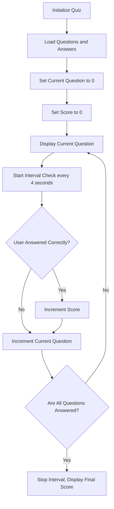

# Quiz Requirements & Workflow

## Functional Requirements

- **State Tracking**:
- Store questions and correct answers in an array of objects.
- Maintain `currentQuestionIndex` initialized to `0`.
- Maintain `score` initialized to `0`.
- Track active `userAnswer` input.

- **Quiz Execution**:
- Render active question based on `currentQuestionIndex`.
- Run a 4-second timer interval (`setInterval`) for question checking/progression.
- Evaluate `userAnswer` against correct answer:
- If correct: Increment `score` by 1 and advance to next question.
- If incorrect/timeout: Advance to next question without incrementing score.

- **Completion**:
- Detect when all questions have been displayed (`currentQuestionIndex >= questions.length`).
- Stop the interval timer (`clearInterval`).
- Render final score summary screen.

---

## Workflow Diagram

