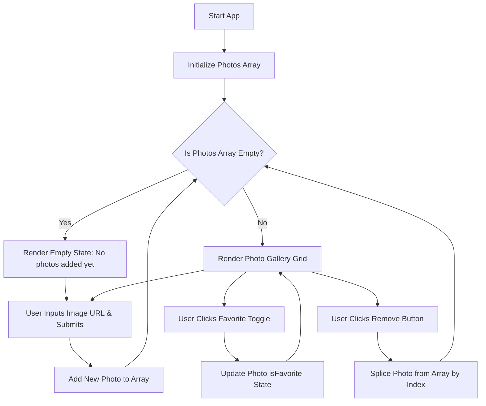

# Photo Gallery Requirements & Workflow

## Functional Requirements

- **State Tracking**:
- Store uploaded photos as an array of objects (each containing `id`, `url`, and `isFavorite`).

- Maintain `newPhotoUrl` input state for image link entries.

- **Photo Upload**:
- Accept image link entries via the "Enter image URL" input.

- Add new photo object to the photos array upon submission.

- Clear the input field after a successful upload.

- **Conditional Rendering & Gallery**:
- **Empty State**: Render "No photos added yet. Add some!" when the photos array is empty.

- **Gallery View**: Display uploaded photos in a gallery grid when the array contains items.

- **Favorite Toggle**: Switch a photo's `isFavorite` state between true and false when clicking its star toggle button.

- **Photo Removal**: Delete a photo from the gallery array at a specific index using `photos.splice(index, 1)` when its dedicated remove button is clicked.

---

## Workflow Diagram

