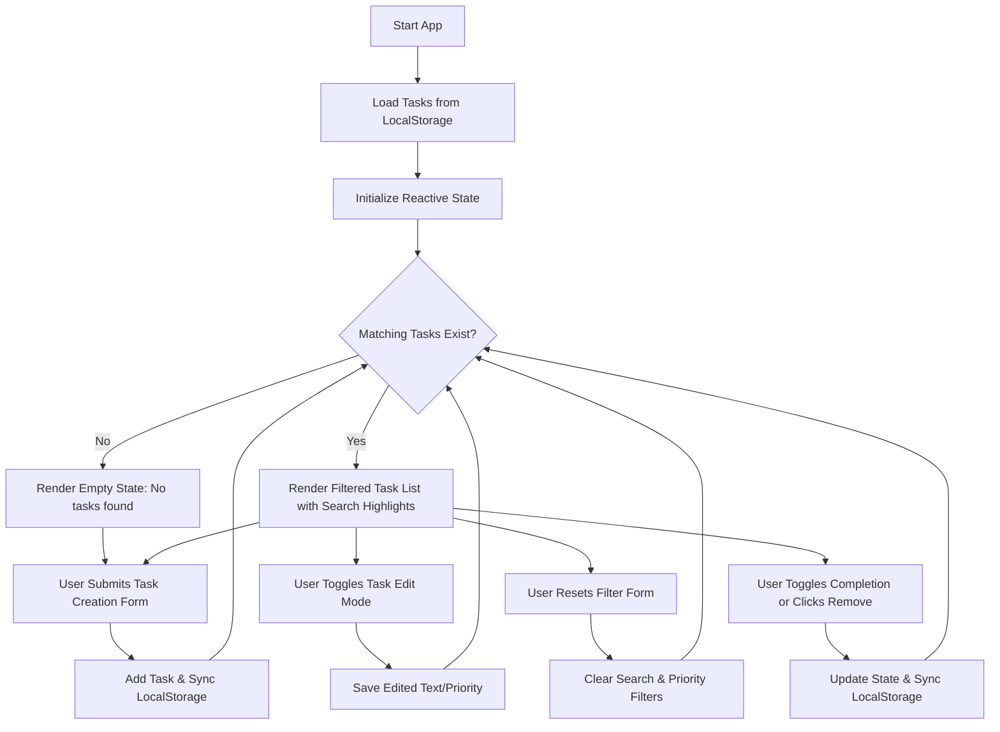

# Task Manager Requirements & Workflow

## Functional Requirements

- **State Tracking**:
- Store tasks as an array of objects (each containing `id`, `text`, `priority`, and `isCompleted`).

- Maintain input states for `newTaskText`, `newTaskPriority`, `searchQuery`, and `selectedPriorityFilter`.

- Track `editingTaskId`, `editTaskText`, and `editTaskPriority` for inline editing mode.

- **Local Storage Persistence**:
- Load saved tasks from `localStorage` on component initialization.

- Automatically persist the updated `tasks` array using a stringified watcher.

- **Task Operations**:
- **Add Task**: Submit text and priority level to create a new task object.

- **Edit Task**: Toggle inline editing mode for any task to modify its text and priority level.
- **Toggle Completion**: Switch a task's `isCompleted` state.

- **Remove Task**: Delete a specific task from the array by ID.

- **Filtering & Search Highlighting**:
- Filter tasks dynamically by task name substring and priority level.

- Highlight search query matches within task titles using a semantic `<mark>` tag.
- **Clear Filters**: Form reset action to clear search and priority filters.

- **Conditional Rendering**:
- Render "No tasks found." when the array or filtered subset is empty.

---

## Workflow Diagram

